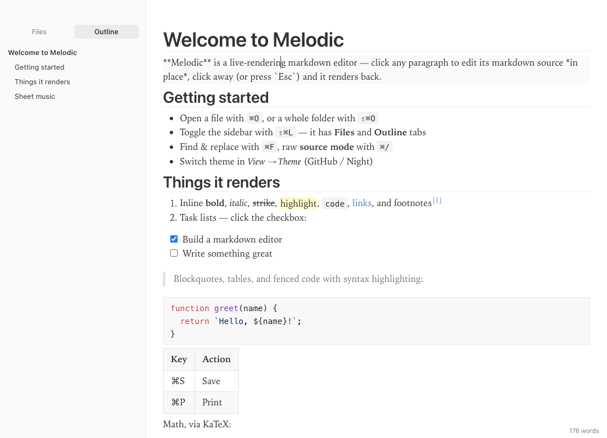
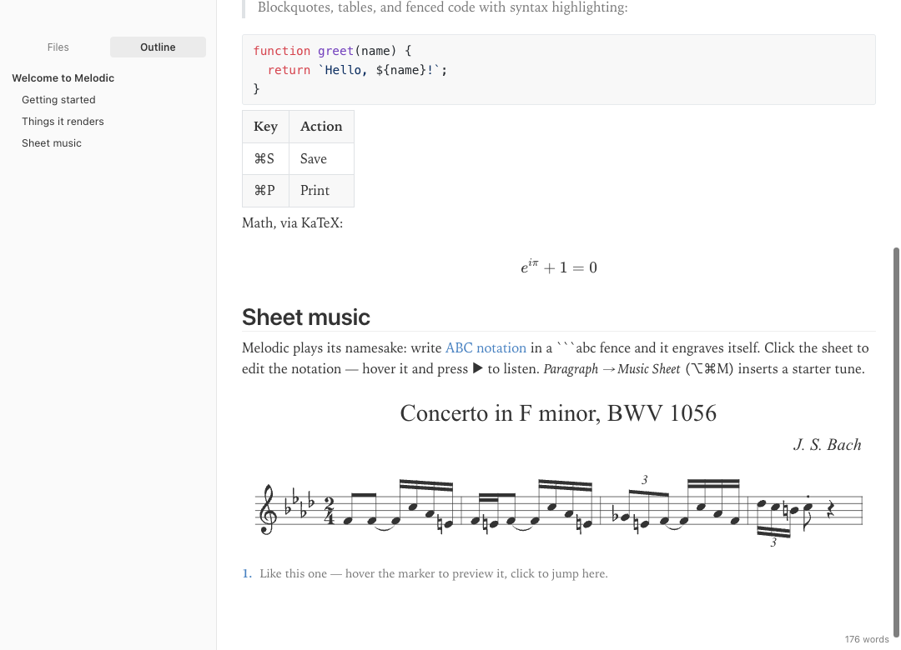
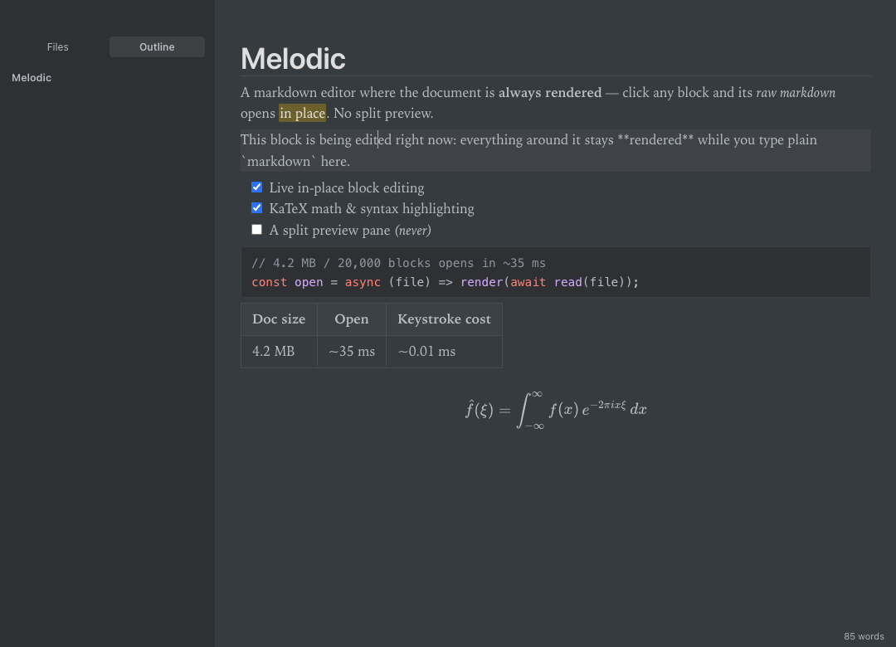

<p align="center"></p>

# Melodic

[](https://github.com/theyueli/melodic/actions/workflows/ci.yml)
[](LICENSE)

A fast, Typora-style **live-rendering markdown editor** for macOS, built with Electron.

The document is always shown rendered — click into any block and its markdown
source is revealed *in place* for editing; click away (or press `Esc`) and it
renders back. No split preview pane.



Write music the way you write prose — ` ```abc ` fences engrave themselves and can play:



<details>
<summary>Night theme</summary>



</details>

## Run it

```bash
npm install
npm start
```

## Install it as an app

```bash
npm run pack
```

produces a signed, double-clickable app at `dist-app/Melodic-darwin-arm64/Melodic.app` —
drag it into `/Applications`. It registers as an editor for `.md`
and `.txt` files and a viewer for `.log`, so "Open With → Melodic" works from Finder.

> Packaging ad-hoc code-signs the bundle (`npm run sign`). This matters: with
> unsigned packager output, macOS Gatekeeper refuses to open downloaded
> (quarantined) documents via "Open With". If you copy the app around and see
> a "could not verify … free of malware" dialog, re-run:
> `codesign --force --deep --sign - /Applications/Melodic.app`

## Features

- **Live block editing** — rendered document; the focused block shows raw markdown
- Headings, lists (with smart `Enter` continuation), quotes, tables, fenced code
  with syntax highlighting, task lists with clickable checkboxes, images,
  links (⌘-click to open), YAML front matter, setext headings
- **Math** — inline `$…$` and block `$$…$$` via KaTeX
- **Sheet music** — ` ```abc ` fences engrave to real scores (abcjs) with
  one-click playback; click a sheet to edit its notation (⌥⌘M inserts one)
- `==highlight==`, **bold**, *italic*, ~~strike~~, `code`, underline
- **Sidebar** (⇧⌘L) with **Files** (open a folder) and **Outline** tabs
- **Source mode** (⌘/) — edit the whole document as raw markdown
- **Themes** — GitHub (light) and Night (dark), with New York serif typography
- **Chinese reading comfort** — predominantly-Chinese documents automatically get
  CLREQ-informed typography: justified 42-char measure, 禁则 line breaking,
  CJK–Latin autospacing, and upright 楷体 emphasis
- **Footnotes** — `[^1]` references with hover preview and click-to-jump
- **Multiple windows** (⇧⌘N) — files from Finder open in a fresh window when the
  current one is in use
- **Spell check** — native macOS checker on the block you're editing, with
  suggestions and Learn Spelling in the context menu (toggle in Edit menu)
- **Find & Replace** (⌘F) — case/whole-word/regex, highlight-all, replace one or all
- **Visual table editing** — click a table for an editable grid: add/remove rows
  and columns, set column alignment, Tab between cells
- **Smart clipboard** — pasting rich text/HTML converts to markdown; ⇧⌘V pastes
  plain; *Copy as Rich Text* pastes formatted into Word/Gmail
- **Plain text & logs** — `.log` files open verbatim (no markdown), with ANSI
  terminal colors, ERROR/WARN line tinting, and live tail-follow that streams
  appended lines like `tail -f`; toggle any file with View → Plain Text Mode
- **Export to HTML and PDF**, and native printing (⌘P)
- Word count, undo/redo, drag-and-drop to open, unsaved-changes protection

## Built for speed

Melodic is engineered to stay instant on documents that choke other editors
(measured on a 4.2MB / 20,000-block document, Apple Silicon):

- opens and renders in **~35ms** (virtualized first paint, idle-time fill-in)
- click-to-edit responds in **~15ms**; committing a block takes **~2ms**
- typing costs **microseconds** of main-thread work per keystroke
  (native `field-sizing` textareas, all bookkeeping throttled off the hot path)
- the startup bundle is **71KB**; KaTeX and highlight.js load lazily only when
  a document actually uses math or code, then upgrade blocks in place
- rendered blocks are LRU-cached; scrolling is native-speed after an idle-time
  layout warmup (`content-visibility` virtualization is progressively released)
- a 5.7MB / 60,000-line ANSI-colored log opens in **~95ms** in plain-text mode

## Key bindings (macOS)

| Keys | Action |
| --- | --- |
| ⌘N / ⌘O / ⇧⌘O | New / Open file / Open folder |
| ⌘S / ⇧⌘S | Save / Save As |
| ⌘/ | Toggle source mode |
| ⇧⌘/ | Toggle plain text mode |
| ⇧⌘F | Follow file changes (tail) |
| ⌘P | Print |
| ⌘F / ⌥⌘F | Find / Find & Replace |
| ⇧⌘N | New window |
| ⌘G / ⇧⌘G | Find next / previous |
| ⇧⌘V | Paste as plain text |
| ⇧⌘L | Toggle sidebar |
| ⌘1…⌘6, ⌘0 | Heading level / paragraph |
| ⌘B, ⌘I, ⌘U, ⌘E | Bold, italic, underline, inline code |
| ⌃⇧X, ⇧⌘H, ⌘K | Strike, highlight, link |
| ⌥⌘C / ⌥⌘B / ⌥⌘Q | Code fence / math block / quote |
| ⌥⌘M | Music sheet |
| ⌥⌘O / ⌥⌘U / ⌥⌘X | Ordered / unordered / task list |
| Esc | Commit the block you're editing |

In the editor: `Enter` splits a block (or continues a list), `Backspace` at the
start of a block merges it with the previous one, arrow keys move between blocks.

## Project layout

```
main.js                 Electron main process (window, menus, dialogs, IPC)
preload.js              contextBridge API exposed to the renderer
renderer/index.html     app shell
renderer/css/           app chrome + GitHub/Night themes
renderer/js/markdown.js marked setup, lazy KaTeX/hljs, render cache, block splitter
renderer/js/editor.js   the live block editor (virtualization, keys, undo, commands)
renderer/js/app.js      wiring: files, sidebar, outline, themes, export
e2e.js / bench.js       dev-only test + benchmark harness (never runs in packaged builds)
```

Development: `npm run selftest` runs the interaction test suite;
`npx electron . --bench=<file.md>` prints performance numbers for a document.
Both are disabled in packaged builds.

## License

MIT
